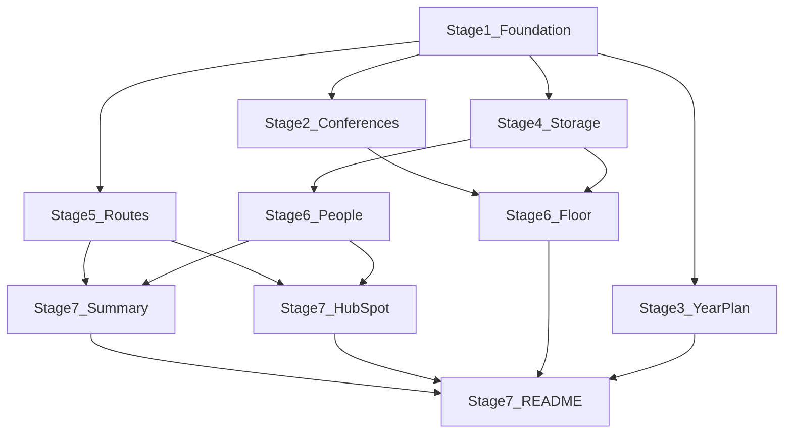

# Conference Intelligence Tool

**Goal:** A four-screen tool a Grain salesperson can use: Discover and prioritize conferences, plan the year, capture a lead on the floor, recognize a repeat contact, and act with one AI summary plus a HubSpot send.

**Architecture:** Next.js (App Router) and TypeScript, deployed on Vercel. Conferences live in a JSON file. Meetings and match confirmations live in `localStorage`. Scoring, clustering, and matching are plain functions. OpenAI and HubSpot are called only from two serverless routes. Integration credentials live in server environment variables only. They are never hardcoded and never sent to the browser. There is no Settings screen.

**Plan file:** [PLAN.md](c:\Users\giliw\Projects\Grain_Assignment\PLAN.md). Implement one stage at a time.

## Decisions

- **Four screens.** Conferences, Year Plan, On the Floor, People. Flow: Discover, Prioritize, Plan, Capture, Recognize, Act. A full CRM is out of scope.
- **Rule-based score.** Vertical, audience type, and a light size nudge. Tiers: Strong (60+), Worth a look (35–59), Skip (under 35). Points: payments 40, fintech 35, treasury 35, travel 30, saas 15, general 5; buyers 20, mixed 10, vendors 0; size under 1,000 is 5, 1,000–5,000 is 10, over 5,000 is 5. Show the tier and a short reason, not an AI score.
- **Clustering is separate.** Same region, start dates within 14 days. It never changes the score. A month with no Strong event is a thin month. Use real published dates. If nothing falls inside 14 days, say so.
- **Matching, four rules only.** Same email = exact. Same LinkedIn URL = exact. Normalized name + same company = likely, grouped automatically. Normalized name + different company = possible, ask Same person or Different people. No nickname or initial logic (`Jon` / `Jonathan` is out of the MVP).
- **Basic normalization.** Trim, lowercase, collapse spaces. Email is trim + lowercase. LinkedIn is lowercase and without a trailing slash. No title lists, accent folding, or company-suffix cleanup.
- **One AI feature.** Relationship Summary, only for a person with 2+ meetings. Generated when the rep asks. No cache and no fingerprint. The route returns a clear not-configured response when `OPENAI_API_KEY` is missing. Do not fake the paragraph.
- **HubSpot is one call.** Create a contact (`email`, `firstname`, `lastname`, `company`) or show the payload if there is no token or no email. No status route, no notes API, no sync.
- **Demo data.** About 12–15 real public conferences. A few seeded people with more than one meeting, so the repeat-contact story is visible on first open. No database, auth, maps, or email sending.
- **Credentials are server-side and user-configurable.** `OPENAI_API_KEY`, `OPENAI_MODEL`, and `HUBSPOT_ACCESS_TOKEN` are read from `.env.local` in local development and from Vercel environment variables when deployed. The person running the app sets those values. Do not hardcode them. Do not expose them in frontend code, `localStorage`, or API responses. Do not add a Settings screen in this MVP. The README and the demo video must say that integration credentials are configured through deployment environment variables.

## Out of scope

`/api/status`, a Settings screen for API keys, summary caching, nickname matching, extra name or company cleaning, a large test suite, user accounts, a database, maps, email sending, AI scoring, a second AI feature, and any HubSpot behavior beyond create-contact or show-payload.

## Shared shapes

`Conference`: `id`, `name`, `startDate`, `endDate`, `city`, `country`, `region`, `vertical`, `audienceSize`, `audienceType` (`buyers`, `mixed`, `vendors`), `url`.

`Meeting`: `id`, `conferenceId`, `capturedAt`, `personName`, `company`, optional `email`, optional `linkedinUrl`, `note`, `interest` (`interested` or `not_now`).

`Confirmation`: `normalizedName`, `decision` (`same_person` or `different_people`).

Storage keys: `grain.meetings`, `grain.confirmations`, `grain.seeded`.

Agreed conference ids so parallel tasks do not invent their own: `money2020-europe`, `money2020-usa`, `sibos`, `singapore-fintech-festival`, `seamless-middle-east`, `moneylive`, `merchant-payments-ecosystem`, `eurofinance`, `phocuswright`, `itb-berlin`, `wtm-london`, `fintech-meetup`, `web-summit`, `saastr`.

## What runs in parallel

- **Sequential first:** Stage 1. It owns the shared types and the three pure functions. Later stages must not edit those files.
- **Parallel after Stage 1:** Stages 2, 3, 4, and 5. Separate files. Stage 3 can import the conference JSON once Stage 2 has created it; until then it can render from the same agreed ids.
- **Parallel with each other, after their dependencies:** Stage 6 Floor (needs Stages 2 and 4) and Stage 6 People (needs Stage 4).
- **Parallel with each other, after Stage 5 and People:** the summary button and the HubSpot button. People should leave two component slots so these do not rewrite the same file blindly.
- **Last, sequential:** README and a manual walkthrough, after the screens exist.

File ownership: Stage 2 owns the conference JSON and the Conferences page. Stage 3 owns the Year Plan page. Stage 4 owns storage and seed meetings. Stage 5 owns the two API routes. Stage 6 splits Floor and People. Stage 7 adds only the two action components, then the README.

---

## Stage 1 — Foundation

**Sequential. Blocks Stages 2–5.**

**What we build:** The Next.js app, shared types, scoring, clustering, matching, a few tests, and nav to four empty pages.

**Why it matters:** Every later stage needs the same data shapes. Locking them first is what makes the parallel work safe.

**Files:** [package.json](c:\Users\giliw\Projects\Grain_Assignment\package.json), [app/layout.tsx](c:\Users\giliw\Projects\Grain_Assignment\app\layout.tsx), [app/page.tsx](c:\Users\giliw\Projects\Grain_Assignment\app\page.tsx) (redirect to `/conferences`), [app/globals.css](c:\Users\giliw\Projects\Grain_Assignment\app\globals.css), [components/AppNav.tsx](c:\Users\giliw\Projects\Grain_Assignment\components\AppNav.tsx), empty `app/conferences/page.tsx`, `app/plan/page.tsx`, `app/floor/page.tsx`, `app/people/page.tsx`, [lib/types.ts](c:\Users\giliw\Projects\Grain_Assignment\lib\types.ts), [lib/scoring.ts](c:\Users\giliw\Projects\Grain_Assignment\lib\scoring.ts), [lib/clustering.ts](c:\Users\giliw\Projects\Grain_Assignment\lib\clustering.ts), [lib/matching.ts](c:\Users\giliw\Projects\Grain_Assignment\lib\matching.ts), one small test file per function, [.env.example](c:\Users\giliw\Projects\Grain_Assignment\.env.example) (`OPENAI_API_KEY`, `OPENAI_MODEL`, `HUBSPOT_ACCESS_TOKEN`), [.gitignore](c:\Users\giliw\Projects\Grain_Assignment\.gitignore).

**Dependencies:** None, except saving PLAN.md first.

**Expected result:** The app runs and shows four links. Tests cover a Strong, a Worth a look, and a Skip score; one cluster inside 14 days and one outside it; email exact, LinkedIn exact, name + same company, and name + different company. A nearby event does not change a score.

## Stage 2 — Conferences

**Parallel with Stages 3, 4, and 5.**

**What we build:** About 12–15 real conferences and the list a rep filters by text, vertical, region, and tier.

**Why it matters:** This is Discover and Prioritize. The rep sees where Grain’s buyers are.

**Files:** [data/conferences.json](c:\Users\giliw\Projects\Grain_Assignment\data\conferences.json), [lib/conferences.ts](c:\Users\giliw\Projects\Grain_Assignment\lib\conferences.ts), [app/conferences/page.tsx](c:\Users\giliw\Projects\Grain_Assignment\app\conferences\page.tsx), [components/ConferenceList.tsx](c:\Users\giliw\Projects\Grain_Assignment\components\ConferenceList.tsx), [components/ConferenceFilters.tsx](c:\Users\giliw\Projects\Grain_Assignment\components\ConferenceFilters.tsx).

**Dependencies:** Stage 1. Use the agreed ids. Verify dates, city, and URL from a public page. Suggested set: Money20/20 Europe, Money20/20 USA, Sibos, Singapore Fintech Festival, Seamless Middle East, MoneyLIVE, Merchant Payments Ecosystem, EuroFinance, Phocuswright, ITB Berlin, WTM London, Fintech Meetup, Web Summit, SaaStr. Add one more only if it is quick.

**Expected result:** Each card shows name, dates, city, vertical, audience size, tier, and a short reason. A link goes to `/floor?conference=<id>`.

## Stage 3 — Year Plan

**Parallel with Stages 2, 4, and 5.**

**What we build:** The year laid out by month, thin months, and trip clusters.

**Why it matters:** This is Plan. Fit was decided on Conferences. Here the rep sees gaps and trips worth combining.

**Files:** [app/plan/page.tsx](c:\Users\giliw\Projects\Grain_Assignment\app\plan\page.tsx), [components/YearPlan.tsx](c:\Users\giliw\Projects\Grain_Assignment\components\YearPlan.tsx).

**Dependencies:** Stage 1, and the conference JSON from Stage 2. Do not edit scoring or clustering.

**Expected result:** Months show conferences with their tier. Months with no Strong event are marked thin. Clusters list cities and the day gap, or the screen says there is no 14-day cluster. Scores stay independent of clusters.

## Stage 4 — Storage and seed people

**Parallel with Stages 2, 3, and 5.**

**What we build:** `localStorage` for meetings and confirmations, plus seed people so the demo is alive on first load.

**Why it matters:** Capture and People share this data. The cross-conference story has to be visible without typing first.

**Files:** [lib/storage.ts](c:\Users\giliw\Projects\Grain_Assignment\lib\storage.ts), [data/seed-meetings.json](c:\Users\giliw\Projects\Grain_Assignment\data\seed-meetings.json).

**Dependencies:** Stage 1. Seed `conferenceId` values must be from the agreed list.

**Expected result:** First visit copies the seed. Later visits keep edits. A reset function restores the seed. Seed at least: a warming contact (same email, two events, notes get more concrete), a tire-kicker (same name and company, three vague notes), an exact match whose company text changed, a possible match (same name, different company, no email or LinkedIn), and one single-meeting person.

## Stage 5 — Server routes

**Parallel with Stages 2, 3, and 4.**

**What we build:** Two routes. No status route.

**Why it matters:** The browser never sees the API keys. The later buttons need a stable JSON response, including the not-configured case.

**Files:** [app/api/relationship-summary/route.ts](c:\Users\giliw\Projects\Grain_Assignment\app\api\relationship-summary\route.ts), [app/api/hubspot/route.ts](c:\Users\giliw\Projects\Grain_Assignment\app\api\hubspot\route.ts).

**Dependencies:** Stage 1 for the request shapes. No UI.

**Expected result:**

- Summary: `POST` `{ personName, meetings: [{ conferenceName, date, company, note }] }`. With a key, return `{ configured: true, whatChanged, nextAction }` in about 80 words. The prompt knows Grain sells to PSPs, travel wholesalers, cross-border payments, and treasury teams. If the notes never advance, the next action is a direct ask or stop. With no key, return `{ configured: false }`.
- HubSpot: `POST` `{ email, firstName, lastName, company, conferenceName, note }`. Always include that object as `payload`. If email or token is missing, return `{ sent: false, reason, payload }` and do not call HubSpot. If both exist, create the contact with `email`, `firstname`, `lastname`, and `company`, then return `{ sent: true, payload }`.

## Stage 6 — On the Floor and People

**Starts after Stage 4. Floor also needs Stage 2. The two subtasks are safe in parallel.**

**What we build:** A short phone-friendly capture form, and a People list with history plus the possible-match question.

**Why it matters:** Capture has to be fast on a show floor. Recognize has to show the relationship, not only a count, and has to ask before merging a possible job change.

**Files:**

- Floor: [app/floor/page.tsx](c:\Users\giliw\Projects\Grain_Assignment\app\floor\page.tsx), [components/LeadCaptureForm.tsx](c:\Users\giliw\Projects\Grain_Assignment\components\LeadCaptureForm.tsx)
- People: [app/people/page.tsx](c:\Users\giliw\Projects\Grain_Assignment\app\people\page.tsx), [components/PeopleList.tsx](c:\Users\giliw\Projects\Grain_Assignment\components\PeopleList.tsx), [components/MatchConfirmation.tsx](c:\Users\giliw\Projects\Grain_Assignment\components\MatchConfirmation.tsx)

**Dependencies:** Floor depends on Stages 1, 2, and 4. People depends on Stages 1 and 4. Neither subtask edits the other’s files. People leaves two empty slots on a multi-meeting card for Stage 7.

**Expected result:** The form asks for conference, name, company, optional email, optional LinkedIn, one note, and Interested or Not now. Name, company, and conference are required. `?conference=` preselects the event. Save keeps the conference selected and does not open a match dialog. People shows the seed stories, groups exact and likely matches, labels a company change on an exact match, and asks Same person or Different people for a possible match. One meeting does not get a summary slot. Reset demo data lives on People.

## Stage 7 — Act, then a short README

**Summary and HubSpot buttons are parallel after Stages 5 and 6. README is sequential after those buttons, and after Stages 3 and 6 Floor, so the walkthrough covers the whole flow.**

**What we build:** An on-demand relationship summary, a Send to HubSpot action, and setup notes.

**Why it matters:** This closes Recognize and Act. The rep gets one useful AI read and a real path into HubSpot, and a reviewer can run the app.

**Files:** [components/RelationshipSummary.tsx](c:\Users\giliw\Projects\Grain_Assignment\components\RelationshipSummary.tsx), [components/HubSpotSend.tsx](c:\Users\giliw\Projects\Grain_Assignment\components\HubSpotSend.tsx), inserted into the People card slots, then [README.md](c:\Users\giliw\Projects\Grain_Assignment\README.md).

**Dependencies:** Summary and HubSpot UI depend on Stages 5 and 6. README depends on the finished screens.

**Expected result:** Summary is hidden for a single meeting. For 2+ meetings, a button calls the route and shows `whatChanged` and `nextAction`. No caching. A missing key shows a plain not-configured message. Send to HubSpot shows success, or the payload and the reason it did not send. README covers install, `npm run dev`, `npm test`, and editing `data/conferences.json`. It must explain that OpenAI and HubSpot credentials are configurable by the user through environment variables: `.env.local` locally, and Vercel project environment variables when deployed. Keys are not hardcoded, not shown in the frontend, and there is no Settings screen. Manual check: filter to Strong, open the year plan, capture one lead, open People, resolve one possible match, generate or see the missing summary, and send or preview HubSpot.

## Video (not a build stage)

Walk it as a salesperson: a Strong event, a thin month or a cluster, a fast capture, then the tire-kicker and the warming contact. Explain the four match rules and why AI is only the summary. Say that integration credentials are configurable through deployment environment variables (`.env.local` or Vercel), not a Settings screen, and that they stay off the frontend. If you had another week: shared team storage, and attaching the meeting note on the HubSpot contact.
